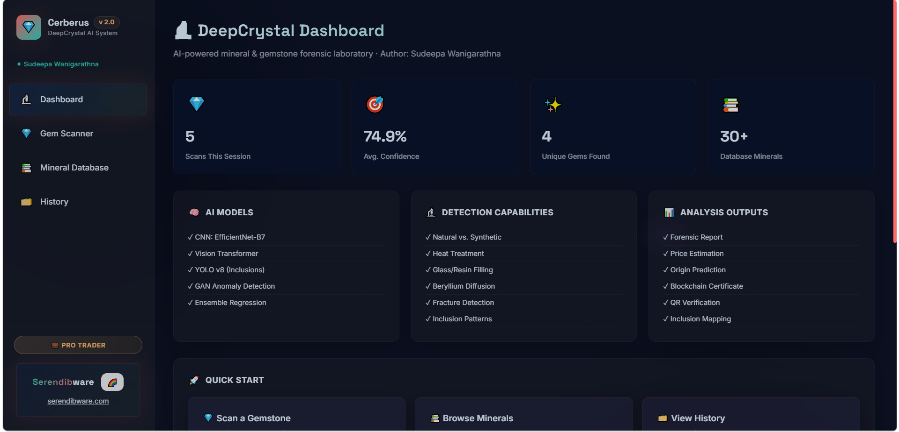
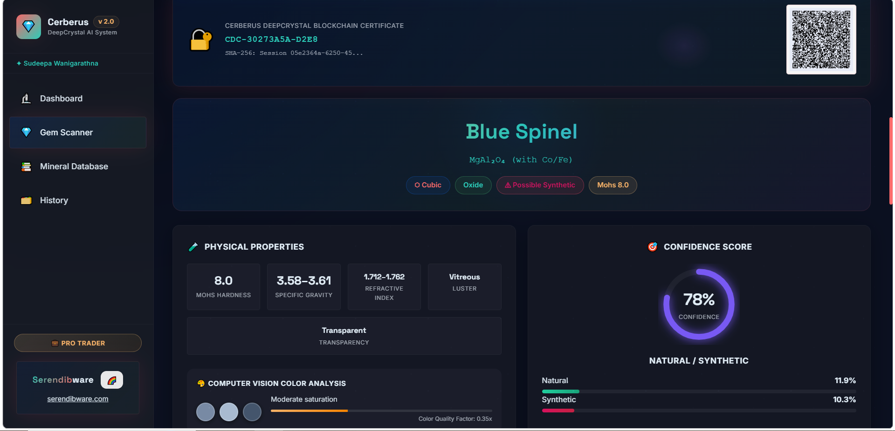
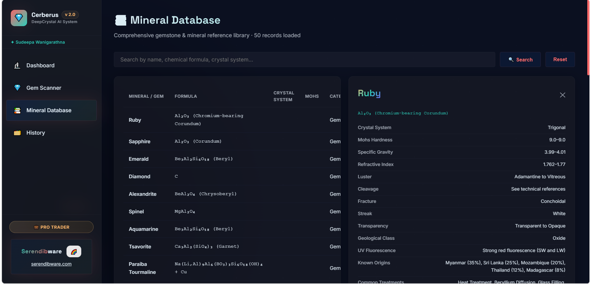
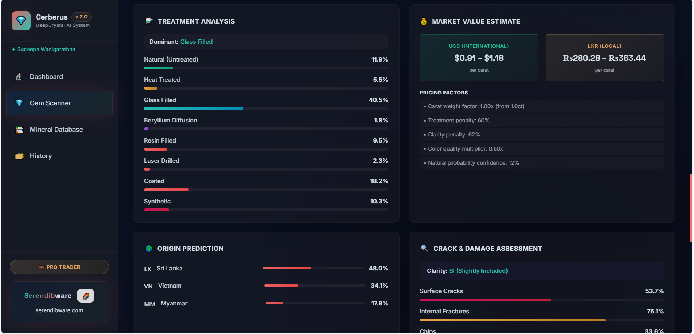

<div align="center">
  
  
  
  
  <br/>
  <h1>💎 Cerberus DeepCrystal</h1>
  <p><b>Advanced AI-Powered Mineral & Gemstone Forensic Laboratory</b></p>
  <p><i>A comprehensive virtual laboratory featuring zero-shot vision transformers, forensic reporting, and blockchain certification.</i></p>
</div>

---

## 📌 Overview
Cerberus DeepCrystal is a cutting-edge web application designed to act as a virtual gemstone and mineral forensic laboratory. By combining real artificial intelligence models (OpenAI CLIP Vision Transformers) with rigorous gemological heuristics, the system identifies gemstones, detects treatments, estimates market value, and generates immutable blockchain certificates.

Recently updated with our signature **"Crystal Facet"** UI—a premium, jewel-toned design system utilizing sapphire, emerald, and ruby aesthetics with glassmorphic refraction effects.

## 🚀 Key Features

* 🧠 **Real AI Vision Pipeline**: Uses the `openai/clip-vit-base-patch32` Vision Transformer to perform true zero-shot image classification against 29 detailed gemstone profiles.
* 🔬 **Comprehensive Forensic Analysis**: 
  * Identifies mineral name, chemical formula, and crystal system.
  * Predicts the likelihood of natural vs. synthetic origin.
  * Detects dominant treatments (Heat, Glass-filled, Diffusion, etc.).
  * Assesses inclusion patterns and surface/internal cracks.
* 💰 **Economic Valuation**: Calculates an estimated market value in USD and local currency based on gemstone weight, natural probability, and treatment detractions.
* 🌍 **Geographic Origin Prediction**: Cross-references visual data with known deposit locations to estimate the gemstone's origin country.
* 🔗 **Blockchain Certification**: Generates a verifiable SHA-256 fingerprint and printable QR code for every analyzed gemstone to serve as an immutable certificate of authenticity.
* ✨ **Crystal Facet UI**: A stunning, high-tech dark mode dashboard built with React and Vite, featuring jewel-toned accents and faceted glassmorphism.

## 📸 Screenshots

<table>
  <tr>
    <th align="center">📱 Dashboard</th>
    <th align="center">🔍 Analysis Scanner</th>
  </tr>
  <tr>
    <td align="center">
      
    </td>
    <td align="center">
      
    </td>
  </tr>
  <tr>
    <th align="center">📚 Mineral Database</th>
    <th align="center">📜 Forensic Report</th>
  </tr>
  <tr>
    <td align="center">
      
    </td>
    <td align="center">
      
    </td>
  </tr>
</table>

## 🛠️ Technology Stack

| Domain | Technologies |
|--------|--------------|
| **Frontend** | React 18, Vite, Custom CSS (Crystal Facet Theme) |
| **Backend API** | Python 3.10+, FastAPI, Uvicorn |
| **Database** | SQLite, SQLAlchemy ORM |
| **AI & ML** | PyTorch, HuggingFace `transformers` (CLIP), `scikit-learn`, `numpy` |
| **Security** | `hashlib` (SHA-256), `qrcode` |

## 📂 Project Structure

```text
Cerberus DeepCrystal/
├── backend/
│   ├── main.py                   # FastAPI Application Root
│   ├── database.py               # SQLAlchemy Database Connection Setup
│   ├── data/
│   │   └── seed_database.py      # Script to populate the 29-mineral database
│   ├── models/
│   │   └── schemas.py            # Pydantic Schemas for API validation
│   ├── routers/                  # API Endpoints (/analysis, /database, /auth, /blockchain)
│   ├── services/
│   │   ├── blockchain.py         # SHA-256 Hashing and QR generation
│   │   └── ml_pipeline.py        # Core AI Engine (PyTorch + CLIP)
│   └── requirements.txt          # Python dependencies
├── frontend/
│   ├── src/
│   │   ├── pages/                # React Pages (Dashboard, Scanner, DB, History)
│   │   ├── components/           # Reusable UI (Report Dashboard)
│   │   ├── App.jsx               # Main React Application
│   │   └── index.css             # Global Styles (Crystal Facet Theme)
│   └── vite.config.js            # Vite configuration and API Proxy
├── start_backend.bat             # Batch script launching FastAPI
└── start_frontend.bat            # Batch script launching Vite
```

## 📖 Using the Platform

Getting started is simple on Windows using the provided launcher scripts:

1. Double-click `install.bat` (first time only) to setup dependencies.
2. Double-click `start_backend.bat` to boot the AI engine.
3. Double-click `start_frontend.bat` to launch the Crystal Facet UI.

See [`HOW_TO_USE.md`](./HOW_TO_USE.md) for detailed instructions on analyzing your first gemstone.

---
*Created by Sudeepa Wanigarathna. Designed for research and demonstration purposes. For high-value transactions, physical laboratory testing is required.*
